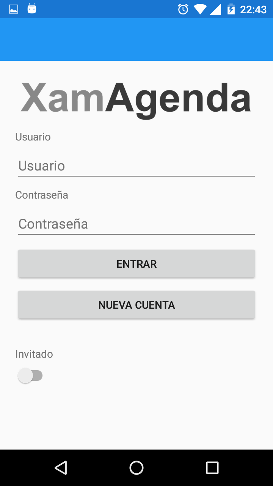
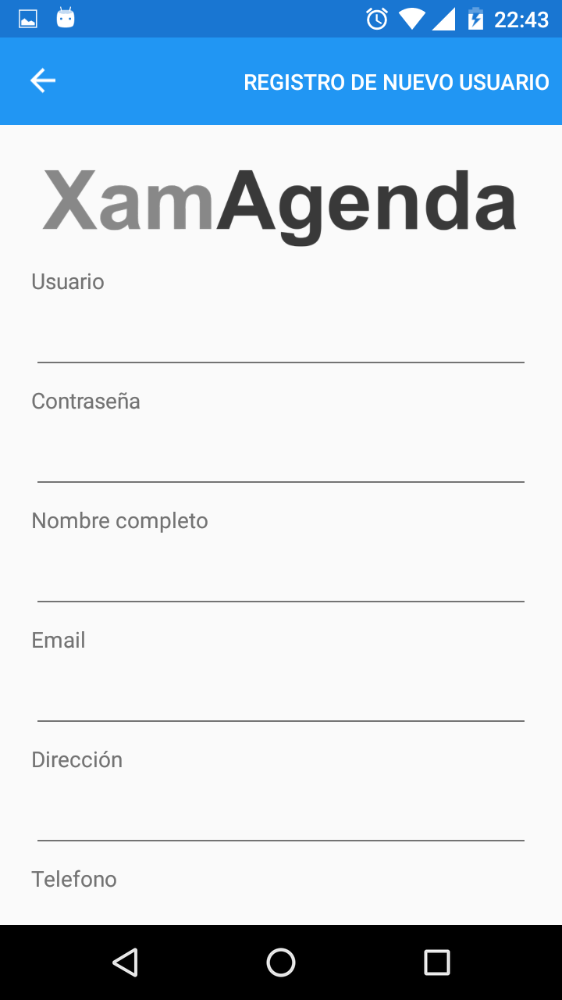
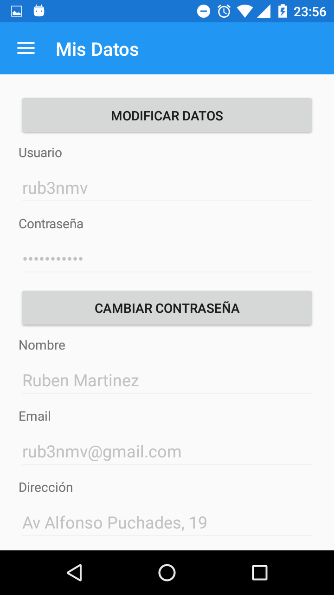
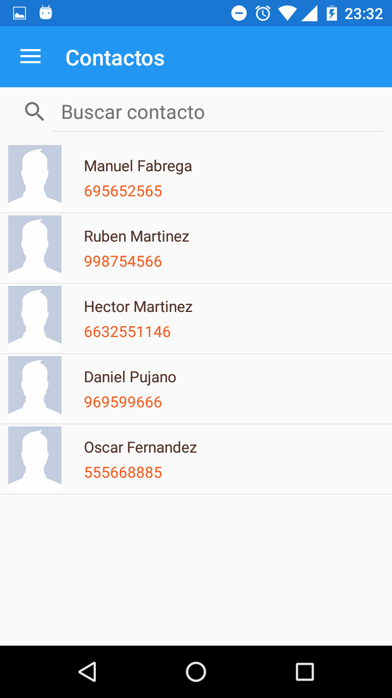
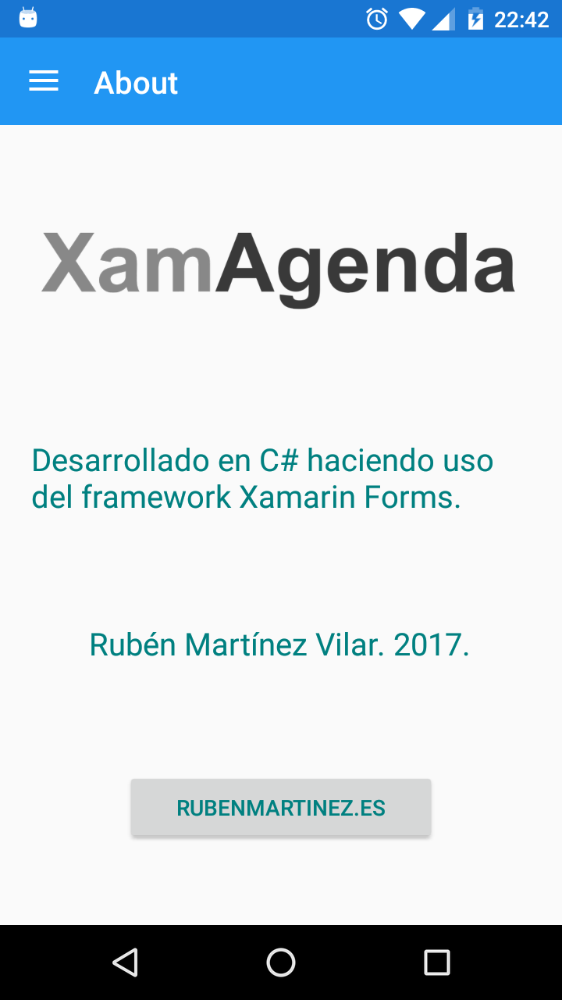

# XamAgenda 
Esta es una pequeña aplicación desarrollada con Xamarin Forms que sirve de aprendizaje de esta plataforma de desarrollo para móviles. 

Agenda personal para guardar contactos y citas. 

Proyecto se ha realizado en Visual Studio 2017. 

## Características del proyecto 
- Uso de **Xamarin Forms** (Multiplataforma).
- Proyecto tipo **PCL**. Se compila en una librería portable DLL.
- Patrón de navegación Master Detail.
- Aplicación de patrones del tipo Model-View-ViewModel, Command y Observer.
- Data Binding en doble sentido.
- Uso de SQLite para guardar la información de manera local.

## Características de la aplicación 
- Login de usuario.
- Lista de contactos.
- Detalles de contactos.
- Búsqueda de contactos.

## TODO 
- Página de detalle de contacto.
- Modificación de la foto del usuario/contacto.
- Lista de citas/eventos.
- Almacenamiento de datos de manera local mediante SQLite.
- Almacenamiento de datos de manera remota mediante web services.

## Capturas de pantalla 

### Login 
 

### Registro de nuevo usuario 
 

### Pantalla principal de los datos del usuario 
 

### Lista de contactos 
 

### About 
 
